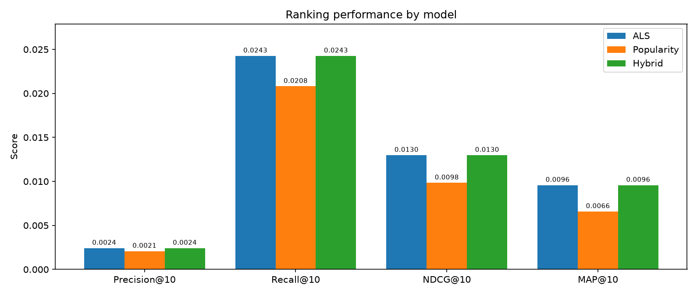

# E-Commerce Recommendation System
### Implicit ALS collaborative filtering on the Amazon Electronics 2023 dataset, with a Streamlit dashboard

An end-to-end implicit-feedback recommender: streaming ingestion of multi-gigabyte
archives, k-core filtering, ALS matrix factorization, a content-based cold-start
path, four ranking metrics, and an interactive dashboard.

---

## Results

Temporal leave-last-out split, 94,249 evaluated users, k = 10. **ALS beats the
popularity baseline on every metric.**

| Model | Precision@10 | Recall@10 | NDCG@10 | MAP@10 |
|---|---|---|---|---|
| **ALS** | **0.0024** | **0.0243** | **0.0130** | **0.0096** |
| Popularity | 0.0021 | 0.0208 | 0.0098 | 0.0066 |
| Hybrid | 0.0024 | 0.0243 | 0.0130 | 0.0096 |

ALS improves on the baseline by **+17% Recall@10, +33% NDCG@10, +45% MAP@10**.
The gap widens as the metric becomes more rank-sensitive, which is what you
expect when personalization is doing real work: ALS is not just retrieving more
relevant items, it is placing them higher.

Under leave-last-out every evaluated user has training history by construction,
so **Hybrid is identical to ALS here by design** — its cold-start path only
activates for users absent from training, which this protocol never produces.
It is exercised in the dashboard, not in this table.

> An earlier version of this project concluded the opposite — that popularity
> beat ALS "due to data sparsity". That result was an artifact of the pipeline,
> not a finding. See [Analysis](#analysis) for what was actually wrong.



---

## Dataset

Amazon Reviews 2023 — Electronics category (reviews 6.0 GB, metadata 1.2 GB, both
gzip-compressed JSONL, not tracked by git).

| Stage | Interactions | Users | Items | Per user |
|---|---|---|---|---|
| Raw (3M streamed) | 2,985,713 | 600,116 | 497,236 | 4.98 |
| After binarization (rating ≥ 4) | 2,359,187 | — | — | — |
| **After 5-core filtering** | **1,003,531** | **94,249** | **51,064** | **10.65** |

Final matrix: 94,249 × 51,064, density 0.0209%. Product titles resolve for
36,311 of 51,064 items (see [Data integrity](#data-integrity)).

### Pipeline
1. Stream reviews line-by-line, keeping only `user_id`, `parent_asin`, `rating`, `timestamp`
2. Drop incomplete rows and non-positive ratings
3. Collapse repeat reviews of the same item by the same user (keep most recent)
4. Binarize: `rating >= 4` becomes an implicit positive
5. **Iterative 5-core filtering** — repeat the user and item filters to a fixed point
6. Build the sparse CSR interaction matrix by vectorized index mapping
7. Temporal leave-last-out split

---

## Setup

Requires **Python 3.12** on macOS (Apple Silicon). `implicit` needs OpenMP:

```bash
brew install libomp
```

```bash
python3.12 -m venv .venv
source .venv/bin/activate
pip install -r requirements.txt
```

Place the raw archives at `data/raw/Electronics.jsonl.gz` and
`data/raw/meta_Electronics.jsonl.gz`. They are available from the
[Amazon Reviews 2023 dataset](https://amazon-reviews-2023.github.io/)
(McAuley Lab, UCSD) and are gitignored because of their size.

---

## Running

```bash
python main.py            # train, evaluate, write artifacts to data/
streamlit run app.py      # interactive dashboard
pytest                    # 81 tests
```

`main.py` takes roughly **1 min 45 s** on a cold cache (streaming and filtering
3M reviews) and **~57 s** thereafter, producing identical metrics either way —
the filtered interactions and resolved metadata are cached as
Parquet under `data/processed/`, keyed by a hash of the config values that
produced them, so editing `config.yaml` invalidates the cache automatically.

Everything resolves paths against the project root, so the commands work from
any working directory.

### Dashboard
- Recommendations for any trained user, with their purchase history
- **Cold start**: unknown user IDs fall back to the content/popularity path
- **Find similar products**: content-based lookalikes from titles and categories

---

## Configuration

All behaviour is driven by [`src/config/config.yaml`](src/config/config.yaml):

| Group | Controls |
|---|---|
| `data` | source paths, `max_records`, cache directory, metadata line budget |
| `filtering` | k-core thresholds, `max_filter_passes`, binarization threshold |
| `split` | `temporal` or `random`, test ratio |
| `als` | factors, regularization, iterations, confidence `alpha` |
| `eval` | `k`, optional user cap |
| `seed` | one seed for splitting, sampling and ALS initialisation |

---

## Architecture

```text
ecommerce-recommender/
├── src/
│   ├── config/config.yaml      # all hyperparameters and paths
│   ├── data/
│   │   ├── load_data.py        # streaming gzip JSONL readers
│   │   ├── preprocess.py       # dedupe, k-core filtering, matrix building
│   │   └── cache.py            # config-keyed Parquet cache
│   ├── models/
│   │   ├── als.py              # implicit ALS wrapper
│   │   ├── popularity.py       # baseline + cold-start floor
│   │   └── content.py          # TF-IDF item-item similarity
│   ├── eval/
│   │   ├── metrics.py          # Precision, Recall, NDCG, MAP
│   │   ├── split.py            # random and temporal splits
│   │   └── evaluate.py         # batched evaluation
│   ├── pipeline.py             # shared data preparation
│   └── utils/helpers.py        # config, paths, logging, plotting
├── tests/                      # 81 tests
├── app.py                      # Streamlit dashboard
└── main.py                     # train + evaluate + persist
```

---

## Analysis

The original pipeline reported ~1.55 interactions per user and concluded that
sparsity made ALS unviable. Four defects produced that number, and fixing them
reversed the result:

**1. Single-pass filtering.** Users were filtered, then items — but dropping
unpopular items pushes users back below the user threshold, and nothing checked
again. Repeating both filters to a fixed point (7 passes here) yields a genuine
5-core: **10.65 interactions per user instead of 1.55**. This was by far the
largest effect.

**2. Ratings used directly as confidence.** Star ratings were fed to ALS as
interaction strengths, so a 1-star review — evidence of *dislike* — became a
positive signal five times weaker than a 5-star one, rather than a negative.
Binarizing at `rating >= 4` states the implicit-feedback assumption correctly.

**3. A random split on temporally ordered data.** Holding out random items lets
the model train on a user's future to predict their past. Leave-last-out by
timestamp measures what a deployed system actually faces.

**4. Incomparable evaluation.** ALS was scored on the first 2,000 users while
popularity was scored on all of them, so the two numbers were never comparable.
Both models now run against an identical user set.

Absolute numbers remain low, as they should: 51,064 candidate items and one
held-out item per user means random guessing scores ~0.0002 Recall@10. ALS
reaches 0.0243 — roughly **124× random**.

---

## Data integrity

**Both raw archives in this project are truncated downloads.** `gzip -t` fails on
each. The readers detect this and stop cleanly at the damage rather than
crashing, so the pipeline runs on the recoverable prefix:

| Archive | Recoverable | Failure |
|---|---|---|
| `Electronics.jsonl.gz` | 36.3M reviews (clean well past 4M) | `invalid block type` near the end |
| `meta_Electronics.jsonl.gz` | ~844,529 records | degrades into one repeating record, then hits EOF |

The reviews file is unaffected in practice — the pipeline reads 3M records from
a clean prefix. The metadata damage is why only 36,311 of 51,064 items resolve a
title; the rest render as "Unknown Product". `data.metadata_max_lines` stops the
scan before the corrupt region. **Re-downloading both archives would restore full
title coverage**; no code change is needed.

---

## Testing

```bash
pytest
```

81 tests covering ranking metrics against hand-computed values, split
determinism and leakage, k-core convergence, duplicate-interaction handling,
index-space alignment between training and serving, loader behaviour on
truncated and malformed archives, and model round-trips.
